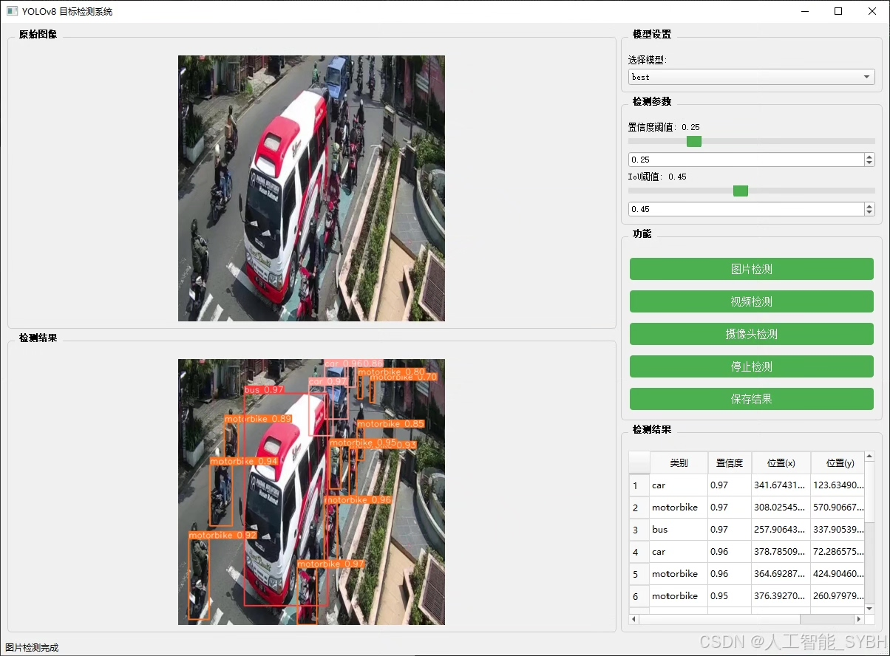
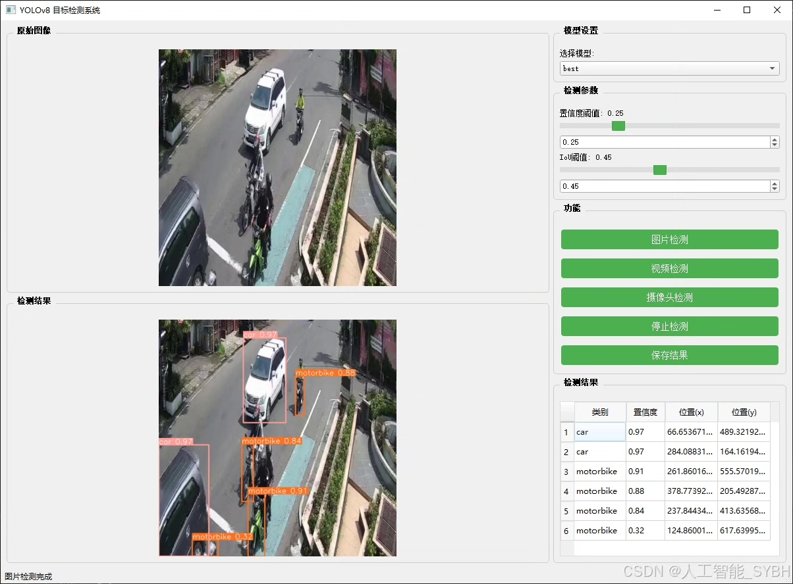
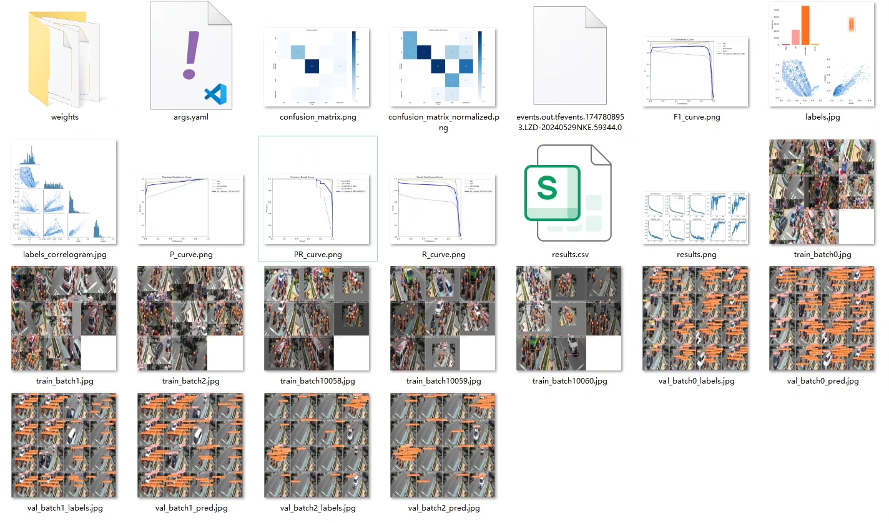
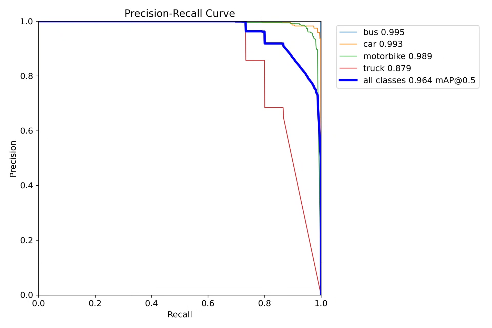
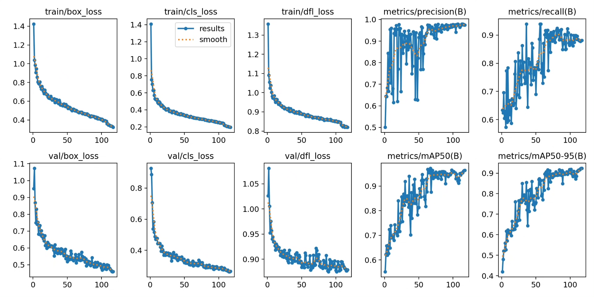
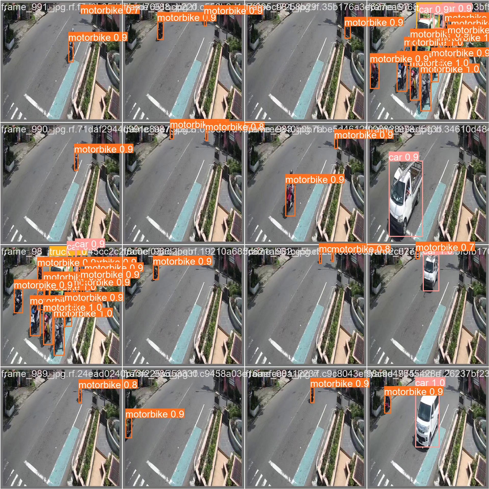
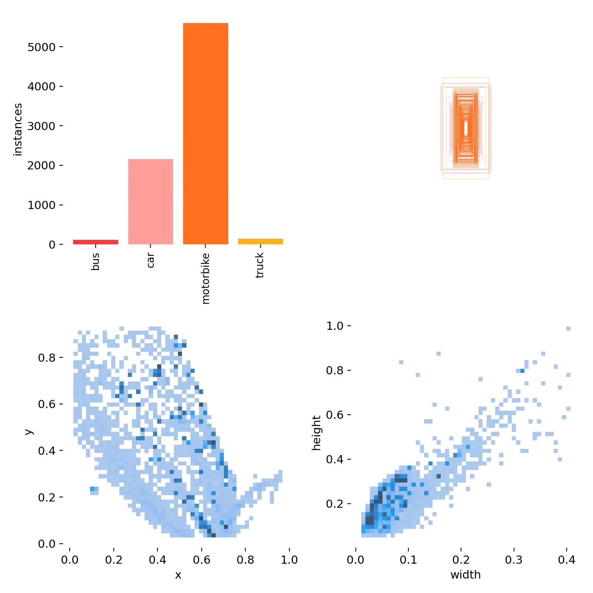
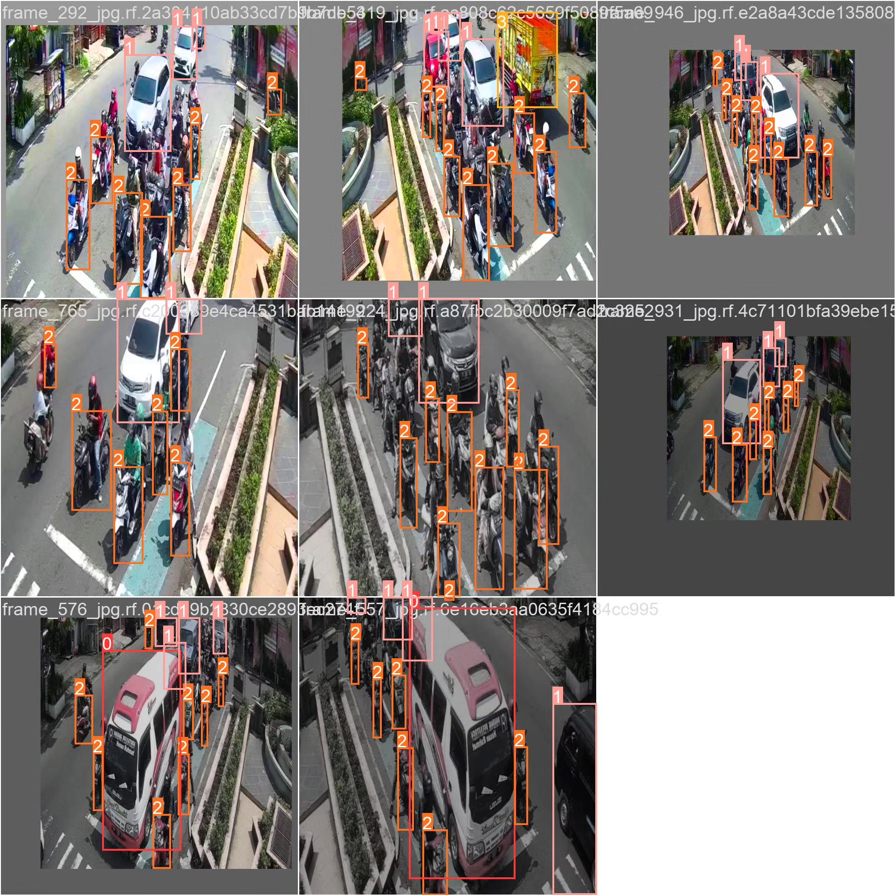

# Vehicle recognition detection system based on deep learning YOLOv8+Y

## Body

This project is based on the advanced YOLOv8 object detection algorithm, developing an efficient and accurate vehicle recognition detection system specifically for multi-class vehicle recognition in road traffic scenarios. The system is optimized for four common vehicle types (buses, cars, motorcycles, and trucks) and uses a dataset containing 1000 images (750 training, 100 validation, and 150 test). The model is trained and evaluated using this dataset. The system achieves real-time video stream and static image vehicle detection and classification, characterized by fast detection speed, high recognition accuracy, and lightweight features. The system can be deployed on various hardware platforms, including servers, edge computing devices, and mobile terminals, providing reliable technical solutions for intelligent transportation management, autonomous driving assistance systems, and road safety monitoring.

The company's products have obtained YOLO official commercial license certification.

Package after-sales service: After payment, we will provide WeChat ID for any questions.

Environment configuration: A tutorial on environment configuration will be provided, with WeChat answering questions available.

Remote installation service: If you need remote configuration, an additional fee of 69 is required, with all fees refunded if the configuration fails (only reimbursement for old computers).

Retraining dataset: Once the environment is configured, you can train on your own computer. If you need us to train it, just pay 69 plus computational power fees (2.5 yuan/hour).

Full after-sales service

## Images

## Payment

Here is a pay link on Stripe ( https://buy.stripe.com/3cs8yP7sY87d0vu9AB ). Please contact me lonlonago@foxmail.com after funding $89, and I will send you a complete data files , thank you!

